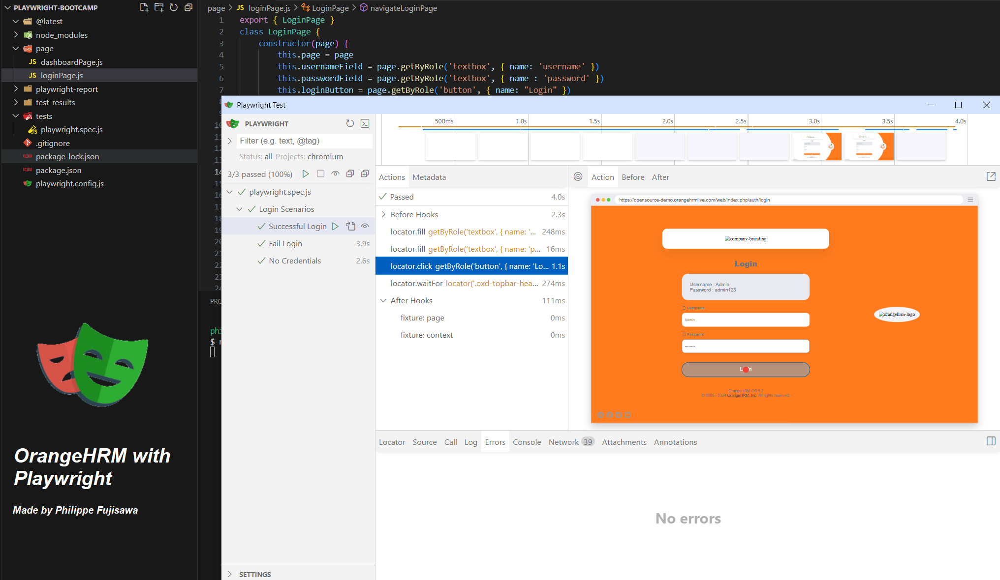

# Automação OrangeHRM Playwright

_Este projeto é uma solução de automação de testes para a aplicação OrangeHRM, uma plataforma web desenvolvida para a gestão de Recursos Humanos. O objetivo deste projeto é praticar e explorar as funcionalidades da ferramenta de automação de testes Playwright._

+ **Page Object Model (POM)**: Implementado para garantir modularidade, reutilização e facilidade de manutenção.
+ **Melhores Práticas**: Utilizou construtores e a função getByRole para seguir padrões modernos e organizados de testes.

## Funcionalidades Automatizadas
**Automação dos seguintes cenários:**

1. Login com credenciais válidas

2. Login com credenciais inválidas

3. Login sem credenciais

### Melhorias Futuras
Planejo implementar algumas melhorias no projeto, incluindo:

+ **Integração com CI/CD usando GitHub Actions:** Adicionar pipelines de CI/CD para automatizar a execução dos testes.
+ **Expansão de Cenários de Teste:** Ampliar o escopo para incluir mais cenários.
+ **Implementação de Relatórios Detalhados:** Adicionar um gerador de relatórios detalhados para oferecer uma visão mais clara dos resultados dos testes.

## Como Executar o Projeto
### Pré-requisitos
Antes de começar, certifique-se de ter instalado:
+ [Node.js](https://nodejs.org/pt)
  
### Installation Steps

1. **Clonar o repositório** para sua máquina local:
```
git clone https://github.com/philfujisawa/playwright-bootcamp.git
```
2. **Navegar para o diretório do projeto.** Vá até onde você clonou o repositório:
```
caminho/para/directorio/playwright-bootcamp
```
3. **Instalar as dependências:**
```
npm install
```
4. **Instalar o Playwright**:
```
npx init playwright
```
Ou:
```
npx create-playwright
```
5. **Rodar Playwright** para executar os testes:
```
npx playwright test --ui
```
Ou, rodar os testes sem interface gráfica:
```
npx playwright test
```
6. **Relatórios** com os resultados:
```
npx playwright show-report
```

Obrigado!