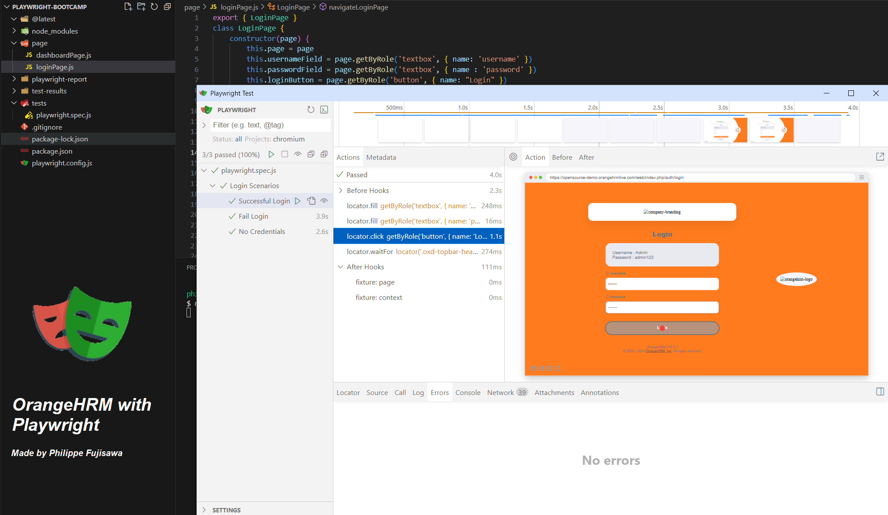

# OrangeHRM Playwright Automation

_This project is a test automation solution for the OrangeHRM application, a web platform designed for HR management. The goal of this project is to practice and explore the functionalities of the Playwright test automation tool._

+ **Page Object Model (POM)**: Implemented to ensure modularity, reusability, and ease of maintenance.
+ **Best Practices**: Utilized constructors and the getByRole function to follow modern, organized testing standards.

**Para README em Português acessar no repositório o documento README-PTBR.md**

## Automated Functionalities
**Automation of the following scenarios:**

1. Login with Valid Credentials

2. Login with Invalid Credentials

3. Login without Credentials

### Future Improvements
I plan some enhancements for the project, including:

+ **Integrate with CI/CD using GitHub Actions:** CI/CD pipelines to automate the test execution process.
+ **Expansion of Test Scenarios:** I aim to broaden the scope to include more scenarios.
+ **Implementation of Detailed Reports:** I want to add a detailed report generator to provide a clearer view of the test results.

## How to Run the Project
### Prerequisites
Before starting, make sure you have installed:
+ [Node.js](https://nodejs.org/pt)
  
### Installation Steps

1. **Clone the repository** to your local machine:
```
git clone https://github.com/philfujisawa/playwright-bootcamp.git
```
2. **Navigate to project directory.** Choose directory based on where you cloned the repository:
```
cd path/to/directory/playwright-bootcamp
```
3. **Install the project dependencies:**
```
npm install
```
4. **Install Playwright**:
```
npx init playwright
```
Or:
```
npx create-playwright
```
5. **Run Playwright** to execute the tests:
```
npx playwright test --ui
```
Or, Headless:
```
npx playwright test
```
6. **Report** execute the results:
```
npx playwright show-report
```

Thank you so much!